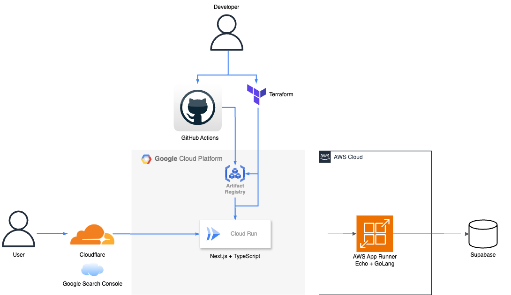

# Next.js + TypeScript + Echo + Go のブログWebアプリケーション(フロントエンド側)(リニューアル版)

# Summary

Zennの記事やQiitaの記事も溜まっており、GitHubに管理しているMarkdownファイルを
読み込んで表示するブログWebアプリケーション。

以下対応。

- 画面デザインの刷新
- VercelからCloud Runに移行
- Cloudflareを導入し、セキュリティ強化

## Site

以下URLで公開しています。

[該当サイト](https://techblogkk.com)

## Tech Stack

## Architecture

## Environment

環境変数は以下ファイルを参照してください。

[Environment](./manuals/environment.md)

## Backend Repository

バックエンド側のリポジトリは以下になります。

[バックエンドリポジトリ](https://github.com/kojikawazu/nextjs-echo-back-blog-app)

## Archived

アーカイブ用リポジトリは以下になります。

[Web側リポジトリ](https://github.com/kojikawazu/archive-nextjs-echo-front-blog-app)