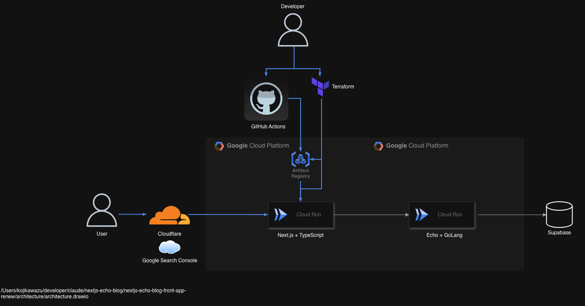

# TechBlog — Markdown ブログ Web アプリ（フロントエンド / リニューアル版）

[](https://github.com/kojikawazu/nextjs-echo-blog-front-app-renew/actions/workflows/pull-request-test.yml)
[](https://github.com/kojikawazu/nextjs-echo-blog-front-app-renew/actions/workflows/deploy_to_googlecloud.yml)
[](./LICENSE)

GitHub 上で管理している Markdown 記事を読み込んで公開する技術ブログ Web アプリ（**TechBlog**）のフロントエンドです。Zenn / Qiita などに散在しがちな技術記事を、自前ブログで一元管理することを目的としています。本リポジトリは旧版（Vercel 運用）からのリニューアル版で、画面デザインの刷新・Google Cloud Run への移行・Cloudflare 導入によるセキュリティ強化を行いました。バックエンド（Echo + Go）は[別リポジトリ](https://github.com/kojikawazu/nextjs-echo-back-blog-app)です。

- 🌐 **公開サイト**: https://techblogkk.com
- 📚 **ドキュメント索引**: [docs/README.md](./docs/README.md)
- 🔙 **バックエンド**: [nextjs-echo-back-blog-app](https://github.com/kojikawazu/nextjs-echo-back-blog-app)（Echo + Go・別リポジトリ）

## 主な機能

| 機能 | 概要 |
|------|------|
| 記事一覧 | カード表示・キーワード検索（300msデバウンス）・カテゴリ/タグ絞り込み・新着/人気ソート・ページネーション |
| 記事詳細 | GitHub URL から Markdown を取得しレンダリング（GFM・改行・シンタックスハイライト） |
| いいね | ゲストを含む全ユーザーが可能。訪問者IDで重複防止 |
| コメント | ゲスト名＋本文で投稿可能 |
| 認証 | メール＋パスワードのログイン / ログアウト（Cookie 認証） |
| 記事 CRUD | 認証ユーザーが記事を作成・編集・削除（オーナーのみ） |
| サイドバー | カテゴリ一覧・人気記事 TOP5・タグ一覧 |

> **未実装（既知）**: 新規登録（`/register`）は UI のみのスタブ、コメント返信は型定義（`parent_id`）のみ。詳細は [docs/11-tasks.md](./docs/11-tasks.md) を参照。

## 技術スタック

**Frontend**

[](https://nextjs.org/)
[](https://www.typescriptlang.org/)
[](https://tailwindcss.com/)
[](https://tanstack.com/query/latest)
[](https://react-hook-form.com/)
[](https://github.com/colinhacks/zod)
[](https://github.com/remarkjs/react-markdown)

**Infra / Deploy**

[](https://cloud.google.com/run)
[](https://cloud.google.com/artifact-registry)
[](https://www.cloudflare.com/)
[](https://www.docker.com/)
[](https://www.terraform.io/)

**CI / Tooling**

[](https://github.com/features/actions)
[](https://vitest.dev/)
[](https://playwright.dev/)
[](https://prettier.io/)

主要バージョン:

| 項目 | バージョン |
|------|-----------|
| Node.js | 20.x |
| Next.js | 16.x |
| React | 18.x |
| TypeScript | 5.x |
| Tailwind CSS | 3.4.x |
| パッケージマネージャ | pnpm |

## アーキテクチャ

```
ブラウザ → Cloudflare(CDN/WAF) → Cloud Run(Next.js + BFFプロキシ) → Cloud Run(Echo API) → DB
                                          │
                                          └→ GitHub API（Markdown取得）
```



クライアントはすべて `/api/*`（Next.js Route Handler = BFF プロキシ）経由でアクセスし、バックエンド URL を秘匿しています。Provider 構成・データフロー・デプロイ詳細は [docs/09-architecture-specification.md](./docs/09-architecture-specification.md) を参照。

## 必要要件

- **Node.js 20 以上**（Next.js 16 の要件。`.nvmrc` あり → `nvm use` で切替可能）
- **pnpm**（`npm install -g pnpm`）
- **バックエンド API**（Echo + Go）がローカルまたはリモートで起動していること。別リポジトリ [nextjs-echo-back-blog-app](https://github.com/kojikawazu/nextjs-echo-back-blog-app) を参照

## クイックスタート

```bash
# 1. クローン
git clone https://github.com/kojikawazu/nextjs-echo-blog-front-app-renew.git
cd nextjs-echo-blog-front-app-renew

# 2. Node バージョンを合わせる（nvm 利用時）
nvm use            # .nvmrc の 20 を使用

# 3. 環境変数ファイルを用意して値を埋める（フロントアプリ配下）
cp apps/front/.env.example apps/front/.env
#   → BACKEND_API_URL をバックエンドの起動先に設定（例: http://localhost:8080）
#   → 詳細は manuals/environment.md を参照

# 4. 依存関係をインストール（リポジトリ直下でワークスペース全体を install）
pnpm install

# 5. 開発サーバー起動 → http://localhost:3000
pnpm dev            # ルートの委譲スクリプト（= pnpm --filter front dev）
```

> **モノレポ構成**: pnpm ワークスペースで管理し、フロントアプリは `apps/front/` に集約しています。ルートの `package.json` は各コマンドを `apps/front` に委譲するため、`pnpm dev` / `pnpm build` / `pnpm test` 等はリポジトリ直下からそのまま実行できます（`pnpm --filter front <script>` でも可）。

> ⚠️ **バックエンドが必要です。** 記事一覧・ログイン・コメント等は BFF プロキシ経由でバックエンド API を呼び出します。`BACKEND_API_URL` が未設定／到達不能だと API は 500 を返します。ローカルで全機能を動かすにはバックエンド（別リポジトリ）を起動してください。

環境変数の一覧と本番（Secret Manager）構成は [manuals/environment.md](./manuals/environment.md) にまとめています。

## 開発

```bash
pnpm dev                  # 開発サーバー
pnpm build                # 本番ビルド
pnpm start                # 本番サーバー

pnpm lint                 # ESLint
pnpm format               # Prettier 自動修正
pnpm format:check         # Prettier チェックのみ
```

## テスト

```bash
# ユニットテスト（Vitest + Testing Library）
pnpm test                 # 全ユニットテスト
pnpm test:watch           # ウォッチモード

# インテグレーションテスト（Vitest + testcontainers・要 Docker）
pnpm test:it              # 実 Go バックエンド + 実 PostgreSQL を起動して IT 実行
#   → バックエンド repo（別リポジトリ）を参照しイメージをビルドする。
#     既定は兄弟ディレクトリ。配置が異なる場合は BACKEND_REPO_PATH で指定。

# E2E テスト（Playwright）
pnpm test:e2e             # HTMLレポート付き
pnpm test:e2e:ui          # インタラクティブUI
pnpm test:e2e:headed      # ブラウザ表示

# 特定の E2E ファイルのみ実行（apps/front を起点に実行）
pnpm --filter front exec playwright test e2e/tests/pages/blog_home/blog_home_unauth.spec.ts
```

テスト方針・ケース一覧は [docs/08-test-specification.md](./docs/08-test-specification.md) を参照。

## デプロイ

`main` ブランチへの push で GitHub Actions が自動実行されます。

1. ユニットテスト（Vitest）→ E2E テスト（Playwright）
2. Docker イメージビルド（マルチステージ）
3. Artifact Registry へ push
4. Google Cloud Run へデプロイ

デプロイ構成・シークレット注入の詳細は [docs/09-architecture-specification.md](./docs/09-architecture-specification.md) を参照。

## ドキュメント

仕様・設計の全体像は **[docs/README.md（ドキュメント索引）](./docs/README.md)** から辿れます。

| 内容 | 参照先 |
|------|--------|
| 機能仕様（画面・操作フロー） | [docs/03-functional-specification.md](./docs/03-functional-specification.md) |
| API（BFF プロキシ・エンドポイント） | [docs/07-api-specification.md](./docs/07-api-specification.md) |
| アーキテクチャ・ディレクトリ構成 | [docs/09-architecture-specification.md](./docs/09-architecture-specification.md) |
| 環境変数 | [manuals/environment.md](./manuals/environment.md) |

## ライセンス

[MIT License](./LICENSE)
